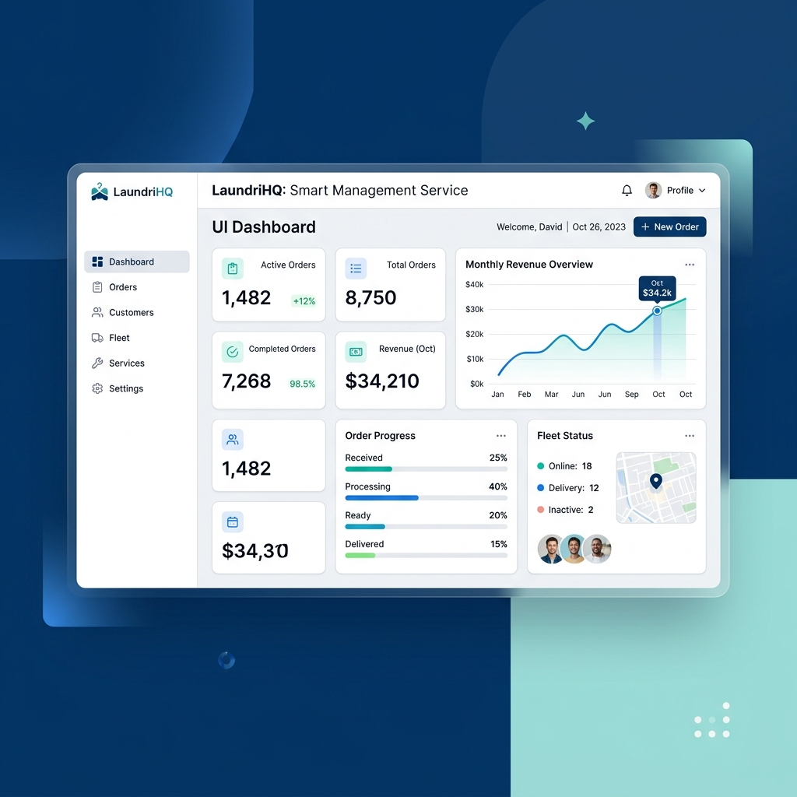

# 🧺 LaundryKu — Aplikasi Kasir & Manajemen Laundry Modern

<div align="center">
  

  [](https://vite.dev/)
  [](https://react.dev/)
  [](https://tailwindcss.com/)
  [](https://www.typescriptlang.org/)
  [](https://expressjs.com/)
</div>

---

**Laundry-ku** adalah aplikasi kasir (POS) dan manajemen operasional laundry modern berbasis web. Dirancang khusus untuk membantu pemilik toko laundry (tenant) mengelola data transaksi, pelanggan, katalog jasa laundry, status pengerjaan pakaian secara real-time, hingga visualisasi laporan keuangan harian dan bulanan secara interaktif.


---

## ✨ Fitur Utama

- 📊 **Dashboard Interaktif**: Ringkasan data transaksi, status operasional laundry (Pending, Washing, Ironing, Ready, Delivered), grafik pemasukan bulanan, dan total pesanan.
- 👥 **Manajemen Pelanggan**: Pencatatan data pelanggan meliputi nama, nomor telepon, email, dan alamat.
- 🛠️ **Manajemen Jasa & Layanan**: Pengelolaan katalog jenis jasa laundry, harga per unit (kg atau pcs), serta satuan pengerjaan.
- 🛍️ **Transaksi Kasir (Checkout)**:
  - Pemilihan pelanggan & multi-layanan dalam satu transaksi.
  - Kalkulasi otomatis total harga dan berat.
  - Pilihan metode pembayaran modern (Tunai, QRIS, Transfer Bank).
  - Pengiriman nota tagihan (invoice) otomatis melalui email pelanggan.
- 📍 **Pelacakan Status Real-time**: Memantau perkembangan pengerjaan pakaian pelanggan langkah-demi-langkah (Pending ➔ Washing ➔ Ironing ➔ Ready ➔ Delivered).
- 📈 **Laporan Keuangan Terpadu**: Visualisasi laba/pendapatan dalam diagram grafik yang informatif untuk menganalisis perkembangan bisnis.
- 🔒 **Sistem Otentikasi JWT**: Registrasi toko baru dan login multi-tenant yang aman dengan token JWT.

---

## 💻 Kecocokan Browser (Browser Compatibility)

Aplikasi Laundry-ku telah diuji dan berjalan optimal pada browser-browser modern berikut:

| Google Chrome | Mozilla Firefox | Safari | Microsoft Edge | Opera |
| :---: | :---: | :---: | :---: | :---: |
|  |  |  |  |  |
|  |  |  |  |  |

---

## 🛠️ Langkah Instalasi & Set Up Lokal

Ikuti langkah-langkah di bawah ini untuk menjalankan aplikasi di komputer lokal Anda:

### 📋 Prasyarat (Prerequisites)
Pastikan komputer Anda sudah menginstal:
- [Node.js](https://nodejs.org/) (versi 18 ke atas direkomendasikan)
- [npm](https://www.npmjs.com/) (termasuk saat menginstal Node.js)

### 🚀 Menjalankan Aplikasi

1. **Clone repositori project ini** ke direktori lokal Anda.
2. **Masuk ke folder project:**
   ```bash
   cd fe-laundry
   ```
3. **Instal seluruh dependensi project:**
   ```bash
   npm install
   ```
4. **Buat & Konfigurasi Environment Variables:**
   Buat sebuah file baru bernama `.env` di root direktori project, lalu isi dengan endpoint backend:
   ```env
   VITE_API_URL=[ISI_URL_API_ANDA]
   ```
5. **Jalankan server development lokal:**
   ```bash
   npm run dev
   ```
6. **Buka browser Anda** dan akses:
   👉 **[http://localhost:3000](http://localhost:3000)**

---

## 📁 Struktur Direktori Project

```text
fe-laundry/
├── assets/                  # Aset gambar & ilustrasi (termasuk banner)
├── src/
│   ├── components/          # Komponen UI global (Layout, Navbar, dll)
│   ├── lib/                 # Konfigurasi utilitas (api.ts, utils.ts)
│   ├── pages/               # Halaman-halaman utama (Dashboard, Orders, dll)
│   ├── types.ts             # Definisi tipe TypeScript
│   ├── main.tsx             # Entry point React
│   └── vite-env.d.ts        # Deklarasi tipe environment Vite
├── server.ts                # Server lokal Express untuk melayani Vite & Mock APIs
├── package.json             # Dependensi dan script build npm
├── tsconfig.json            # Konfigurasi compiler TypeScript
└── vite.config.ts           # Konfigurasi bundling Vite
```

---

## ⚙️ Skrip Perintah (Build & Production)

Di dalam `package.json`, Anda dapat menggunakan perintah-perintah berikut:

- `npm run dev` : Menjalankan server lokal pengembangan di port 3000 dengan hot-reloading.
- `npm run build` : Mem-bundle aplikasi frontend ke folder `dist` dan me-compile `server.ts` untuk server produksi.
- `npm run start` : Menjalankan server backend Express versi build produksi untuk menyajikan file-file statik.
- `npm run lint` : Memvalidasi tipe kode TypeScript di seluruh project secara statis.
